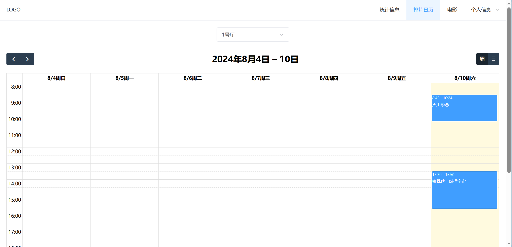

# Backend

```
cd backend
npm install
npm start
```

# Frontend

```
cd frontend
npm install
npm run dev
```

# Project Introduction

This is a website built for my database course project, which can enable you to manage movie ticket sales as an admin and purchase tickets as a customer. 

The data is stored in my MySQL database, and I used a local HTTP server. Even if you launch the backend and frontend of this project, you may not be able to see anything. But if you are a beginner like I was when I developed this project (summer 2023), I hope my source code can still be helpful to you. You can simply copy it and ask the GPT to explain what it all means.

I received an A for this course project. However, this is just a small and basic project for an undergraduate student. Full-stack development in the real world is much more complicated, and I'm not highly experienced in it yet.



